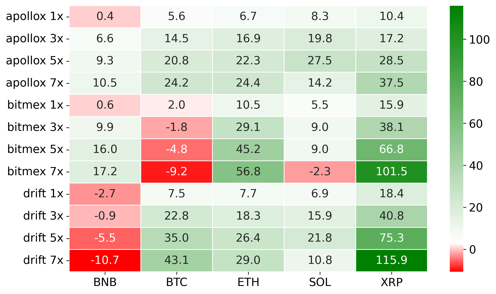
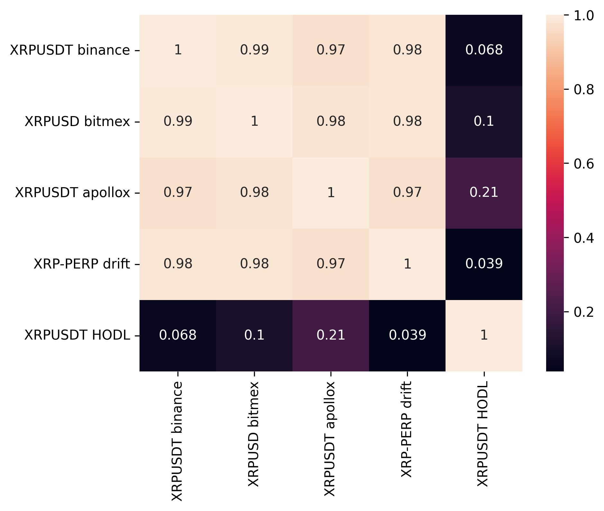
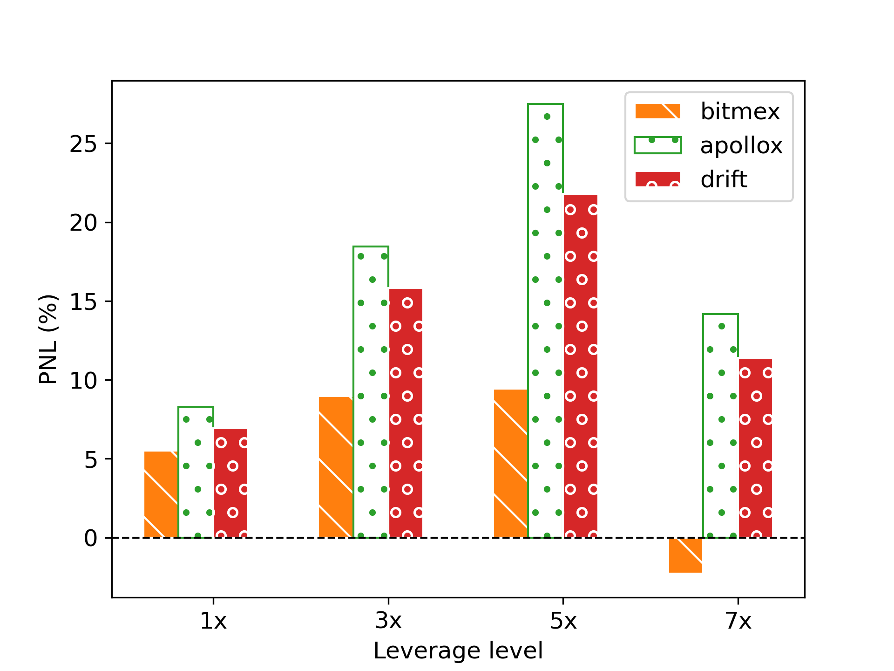
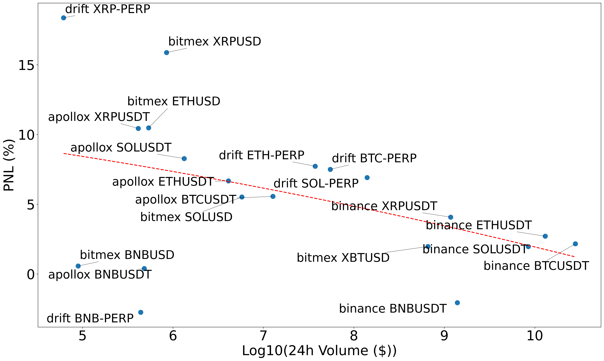
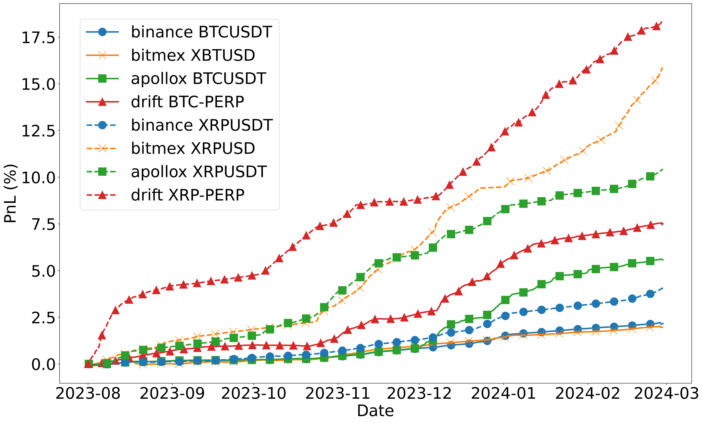

# Funding rate arbitrage risk and return analysis
This repository is used for funding rate data analysis. It contains scripts to download funding rate and price data from multiple exchanges (both CEX and DEX). The downloaded data is then analyzed using Jupyter notebook and Pandas library. 

## Setup
1. Create virtual env
`poetry shell`
2. Install dependencies
`poetry install`

## Data analytic procedure
1. Download data by running the `nb_load_data.ipynb` file. Raw data (OHLC price and funding rate history) will be stored in `modules/data` and aggregated data (in CSV) will be stored in `data` folder for later use. Note that the script will download historical data from the current time and move backward until it reaches the first data point provided by each exchange API. The script will stop API calling for that market when it finds an existing file in some month. If the persisted data in some month is not complete, please delete it and the later data to let the script re-downloads it from the current time until that data point again. Some API may blocks you from calling and makes the data in some month not complete. To handle that, you may need to re-download the data of that exchange only. To select markets and exchanges to download data, simply comment the unused parts in the `exchanges_markets` variable in `nb_load_data.ipynb`.
2. For each analysis, the prepared data can be loaded using `load_cache_data(exchange, market)` function from `common.py`.

## List of notebooks
1. `nb_load_data.ipynb`: Fetch data from exchange APIs and save cached formatted data in the `./data/` folder. Note: Cache data for all exchanges (Binance, Bitmex, ApolloX, and Drift) are downloaded up to February 2024. If you don't need to use later data, you don't need to run this notebook.
2. `nb_plot_heatmap.ipynb`: Plot PNL of 60 combinations (3 exchanges, 5 markets, 4 leverage levels) into a heatmap chart.
3. `nb_plot_hodl_corr.ipynb`: Plot a correlation matrix (funding rate arb and HODL) of a specified market.
4. `nb_plot_market_size_impact.ipynb`: Plot a scatter plot of market size along with funding rate arbitrage PNL.
5. `nb_plot_return.ipynb`: Plot PNL time series of BTC and XRP across 4 exchanges (Binance, Bitmex, ApolloX, and Drift).
6. `nb_plot_lev_bar.ipynb`: Plot a bar chart showing leverage levels with PNL for a specified market.

## Example charts

    
    
    
    
    

